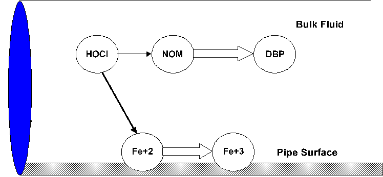
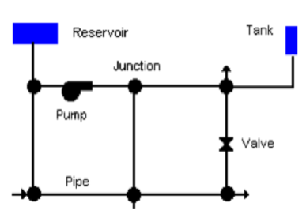
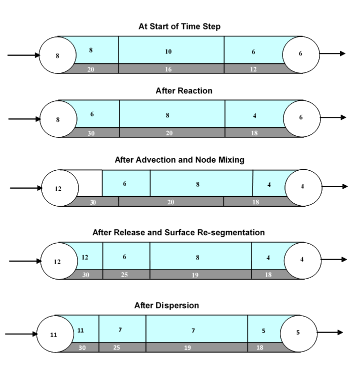

.. raw:: latex

    \clearpage

.. _framework:

CONCEPTUAL FRAMEWORK
=======================

From a water quality modeling perspective, two significant physical
phases exist within a water distribution system: a mobile bulk water
phase and a fixed pipe surface phase. Bulk phase species are chemical or
biological components that exist within the bulk water phase and are
transported through the system with the average water velocity. Surface
phase species are components that are attached or incorporated into the
pipe wall and are thus rendered immobile. :numref:`Figure_2_1` shows an example of
bulk phase chlorine (HOCl) reacting with bulk phase NOM (natural organic
matter) to produce a bulk phase disinfectant by-product (DBP), while
also oxidizing ferrous iron to ferric iron in the fixed surface phase at
the pipe wall.   

.. _Figure_2_1:

   
   Example of reactions in the mobile bulk phase and at the fixed pipe surface phase.

Examples of bulk species include dissolved constituents (individual
compounds or ions, such as HOCl and OCl\ :sup:`-`, as well as aggregate
components such as TOC), suspended constituents (such as bacterial cells
and inorganic particulates), and chemicals adsorbed onto particles.
Examples of surface species include bacteria incorporated within
biofilm, oxidized forms of iron contained within corrosion scale,
particulate material that settles out due to gravity or is attached to
the pipe wall surface through ionic or molecular (i.e., van der Waal)
forces, and organic compounds that can diffuse into or out of plastic
pipes or be adsorbed onto or desorbed from iron oxide pipe surfaces.
Some components, such as bacteria and particulates, can exist in both
the bulk and surface phases and transfer from one phase to another by
such mechanisms as physical attachment/detachment, chemical adsorption
or molecular diffusion. In such situations, the component is modeled as
two species: one bulk and the other surface.

Additional phases that might exist within a distribution system, such as
a mobile bed sediment phase, an immobile water phase within the pore
structure of pipe scale, or an air phase overlying the water surface in
a storage tank, could also be included within this modeling framework.

.. _section-Material_transport:

*Material Transport*
---------------------

A water distribution system consists of pipes, pumps, valves, fittings
and storage facilities that convey water from source points to
consumers. This physical system is modeled as a network of links
connected together at nodes in some particular branched or looped
arrangement. :numref:`Figure_2_2` provides an example of a network representation
of a very simple distribution system. Links represent pipes, pumps, and
valves; nodes serve as source points, consumption points and storage
facilities. The following phenomena all influence the quality of water
contained in the system and can be modeled using principles of
conservation of mass coupled with reaction kinetics:

.. _Figure_2_2:

   Node-link representation of a simple distribution system.

a. *Advective transport in pipes*: bulk species are transported down the
   length of a pipe with the same average velocity as the carrier fluid
   while at the same time reacting with other bulk species and with the
   pipe wall surface.

b. *Dispersive transport in pipes*: due to the differences of concentrations and flow 
   velocities, bulk species spread from highly concentrated to less concentrated areas.
   
c. *Mixing at pipe junctions*: at junctions receiving inflow from two or
   more links the flows are assumed to undergo complete and
   instantaneous mixing.

d. *Mixing in storage nodes*: all inflows to storage nodes mix
   completely with the existing contents in storage while these contents
   are subjected to possible bulk phase reactions (alternative schemes
   are available for modeling plug flow storage tanks).

.. _section-advection_dispersion_reaction:

*Advection, Dispersion and Reaction*
-------------------------------------

One-dimensional mass transport in a pipe with a uniform
cross-sectional area can be described as advection-dispersion-reaction equations. For a specific species,

 .. math:: 
    \begin{aligned}
    \frac{\partial {c_i}}  {\partial {t}} + u \frac{\partial {c_i}}  {\partial {x}}= D_i\frac{\partial^2 {c_i}}  {\partial {x^2}}+r(\boldsymbol{c})
    \end{aligned}
    :label: 1DADR 

where :math:`i` = species index; :math:`c_i` = concentration of the species :math:`i`; :math:`u` = flow velocity; :math:`x` = distance alone the pipe's longitudinal direction;
:math:`D_i` = effective dispersion coefficient of the species :math:`i`; :math:`r_i` = reaction rate of the species :math:`i`; and :math:`\boldsymbol{c}` = the concentration vector of all species which includes both differential and algebraic variables as
defined in :ref:`section-chemical_reaction` (:numref:`section-chemical_reaction`).

The impact of dispersion may be negligible for many parts of water distribution systems under highly turbulent conditions. However, it is important to consider dispersion when modeling
dead-end segments of a system or premise plumbing systems where the flow Reynolds number can be low. The relative importance of the dispersion can be
quantified with the Peclet number:

 .. math:: 
    \begin{aligned}
    Pe_i = {\frac{ul}  {D_i}} 
    \end{aligned}
    :label: Peclet_Number

where :math:`l` = pipe length. The Peclet number is a measure of the relative importance of advection versus dispersion, where a large number indicates an advectiion-dominated flow condition in which the dispersion is negligible.

The effective longitudinal dispersion coefficient accounts for the combined effect of the diffusion and the shear dispersion due to the
nonuniformity of the velocity profile. For laminar flow conditions, the effective dispersion coefficient is calcuated as an averaged value over the residence time :cite:p:`Lee2004`:

 .. math:: 
    \begin{aligned}
    D = {\frac {a^2u^2} {48D_m}}\left[1-\left[\frac{1-exp\left(-16\frac{D_mt_r}{a^2}\right)}{16{\frac{D_mt_r}{a^2}}} \right] \right] 
    \end{aligned}
    :label: Lee_formula
    
where :math:`D_m` = molecular diffusion coefficient; :math:`a` = pipe radius; and :math:`t_r` = pipe residence time (:math:`\frac {l} {u}`).

For turbulent flow conditions, the effective dispersion coefficient does not depend on the molecular diffusion coefficient and the formula
used is :cite:p:`Basha2007`:

 .. math:: 
    \begin{aligned}
    D = au_{\ast}\left[10.1+577\left(\frac{Re}{1000}\right)^{-2.2}\right]
    \end{aligned}
    :label: Basha_formula
    
where :math:`u_{\ast}` = shear velocity; and :math:`Re` = the Reynolds number.

.. _section-chemical_reaction:

*Chemical Reactions*
--------------------

Reactions can be divided into two classes based on reaction rates. Some
reactions are reversible and fast enough in comparison with the system's
other processes so that a local equilibrium can be assumed; others are
not sufficiently fast and/or irreversible and it is inappropriate to use
an equilibrium formulation to represent them. Theoretically, very large
backward and forward rate constants (with their ratio equaling the
equilibrium constant) can be used to model fast/equilibrium reactions
and therefore both fast/equilibrium and slow/kinetic reaction dynamics
can be written as a single set of ordinary differential equations (ODEs)
that can be integrated over time to simulate changes in species
concentrations. This approach can result in reaction rates that may
range over several orders of magnitude and lead to such small
integration time steps so as to make a numerical solution impractical.

In EPANET-MSX, algebraic equations are used to represent the
fast/equilibrium reactions and mass conservation. Thus it is assumed
that all reaction dynamics can be described by a set of
differential-algebraic equations (DAEs) that is in semi-explicit format.
The system of DAEs that defines the interactions between bulk species,
surface species, and parameter values can be written in general terms
as:

 .. math:: 
    \begin{aligned}
    \frac{d \boldsymbol{x_b}}  {d {t}} = \boldsymbol {f(x_b, x_s, z_b, z_s, p)} 
    \end{aligned}
    :label: DAEbulk 

 .. math:: 
    \begin{aligned}
    \frac{d\boldsymbol{x_s}} {d {t}}= \boldsymbol  {g(x_b, x_s, z_b, z_s, p)} 
    \end{aligned}
    :label: DAEwall

 .. math:: 
    \begin{aligned}
    \boldsymbol{0} = \boldsymbol{h(x_b, x_s, z_b, z_s, p)} 
    \end{aligned}
    :label: DAEequil

where the vectors of time-varying differential variables :math:`\boldsymbol{x_b}` and
:math:`\boldsymbol{x_s}` are associated with the bulk water and pipe surface,
respectively, the time-varying algebraic variables :math:`\boldsymbol{z_b}` and :math:`\boldsymbol{z_s}`
are similarly associated, and the model parameters :math:`\boldsymbol{p}` are time
invariant. The algebraic variables are assumed to reach equilibrium in
the system within a much smaller time scale compared to the numerical
time step used to integrate the ODEs. The dimension of the algebraic
equations :math:`\boldsymbol{h}` must agree with that of the algebraic variables :math:`\boldsymbol{z}` =
[:math:`\boldsymbol{z_b}` :math:`\boldsymbol{z_s}`], so that the total number of equations in :eq:`DAEbulk`-:eq:`DAEequil` equals
the total number of time-varying species ([:math:`\boldsymbol{x_b}` :math:`\boldsymbol{x_s}` :math:`\boldsymbol{z_b}` :math:`\boldsymbol{z_s}`]).

As a simple example of a reaction/equilibrium system modeled as a set of
DAEs, consider the oxidation of arsenite (:math:`As^{+3}`) to arsenate
(:math:`As^{+5}`) by a monochloramine disinfectant residual in the bulk
flow and the subsequent adsorption of arsenate onto exposed iron on the
pipe wall. (Arsenite adsorption is not significant at the pH's typically
found in drinking water.) A more complete explanation and extension of
this model is presented in :ref:`examplesystems` (:numref:`examplesystems`) of this manual. This system
consists of four species (arsenite, arsenate, and monochloramine in the
bulk flow, and sorbed arsenate on the pipe surface). It can be modeled
with three differential rate equations and one equilibrium equation:

.. math::
   \begin{aligned}
   \frac{d As^{+3}} {d {t}} = -k_a As^{+3}(NH_2Cl)
   \end{aligned}
   :label: As3

.. math::
   \begin{aligned}
   \frac{d As^{+5}} {d {t}} = k_a As^{+3}(NH_2Cl)-A_v[k_1(S_{max}-As_s^{+5})As^{+5}-k_2As_s^{+5}]
   \end{aligned}
   :label: As5

.. math::
   \begin{aligned}
   \frac{d (NH_2Cl)} {d {t}} =-k_b (NH_2Cl)
   \end{aligned}
   :label: NH2Cl

.. math::
   \begin{aligned}
   As_s^{+5} = \frac{k_s S_{max} As^{+5}}{1+k_s As^{+5}}
   \end{aligned}
   :label: As5S

where :math:`As^{+3}` is the bulk phase concentration of arsenite,
:math:`As^{+5}` is the bulk phase concentration of arsenate, :math:`As_s^{+5}` \ is
surface phase concentration of arsenate, and :math:`NH_2Cl` is the
bulk phase concentration of monochloramine. The parameters in these
equations are as follows: :math:`k_a` is a rate coefficient for arsenite
oxidation, :math:`k_b` is a monochloramine decay rate coefficient,
:math:`A_v` is the pipe surface area per liter pipe volume, :math:`k_1`
and :math:`k_2` are arsenate adsorption and desorption rate
coefficients, :math:`S_{max}` is the maximum pipe surface concentration of
arsenate, and :math:`k_s` = :math:`k_1/k_2`. Thus in terms of
the notation used in :eq:`DAEbulk`-:eq:`DAEequil`, :math:`\boldsymbol{x_b} = {\{As^{+3},
As^{+5}, NH_2Cl\}}`, :math:`\boldsymbol{x_s} = {\{\emptyset\}}`, :math:`\boldsymbol{z_b} = {\{\emptyset\}}`, 
:math:`\boldsymbol{z_s} = {\{As_s^{+5}\}}`, :math:`\boldsymbol{p} = {\{k_a, k_b, A_v, k_1, k_2, S_{max}\}}`. Example input
files for this form of the model are included with the standard
EPANET-MSX distribution, while the input file for a more complex version
of the model is presented in :ref:`examplesystems` (:numref:`examplesystems`).

.. _section-network_solution:

*Full Network Solution*
-----------------------

Dynamic models of water quality within water distribution systems can be
classified spatially as either Eulerian or Lagrangian. Eulerian models
divide the network into a series of fixed control elements and record
the changes at the boundaries and within these elements, while
Lagrangian models track changes of discrete parcels of water as they
travel through the network. EPANET-MSX utilizes the Lagrangian
transport algorithm as used by EPANET. It tracks the movement and reaction of chemicals in discrete
water volumes, or segments. These segments are transported through
network pipes by the bulk velocity, and completely mix at junction
nodes. This method is relatively efficient because the number and size
of the segments in a pipe can change as hydraulic conditions change. In addition, the effevtive dispersion along the 
longitudinal direction is modeled. The details of the Lagranigain algorithm to model advection, dispersion and reaction are described in :cite:p:`Shang2021`.

In summary form, the following steps, depicted visually in :numref:`Figure_2_3`,
are performed for each water quality time step:

1. *React:* Apply reaction dynamics within each pipe segment and storage
   tank over the time step to compute new concentrations throughout the
   network.

2. *Advect:* Within each pipe, compute the flow volume transported over
   the time step and transfer this amount of volume and its associated
   bulk species mass from the pipe's leading segments into accumulated
   mass and volume totals at the downstream node.

3. *Mix:* Compute new bulk species concentrations at each node based on
   its accumulated mass and volume inputs from the advection step as
   well as any external sources.

4. *Release:* Create a new segment at the upstream end of each pipe
   whose size equals the pipe's flow volume and whose bulk species
   concentrations equal that of the upstream node (or if the difference
   in quality between the most upstream segment and the upstream node is
   below some tolerance, simply increase the size of the current
   upstream segment).

5. *Disperse:* Solve the disperison process equation and update both nodal and segment concentrations.

.. _Figure_2_3:

   Illustration of the 5-step water quality transport method for pipe networks. The upper pipe segments contain flowing water while the lower segments are the pipe wall surface. The numbers in each segment represent hypothetical bulk and surface species concentrations, respectively.

.. _section-reaction_solution:

*Reaction System Solution*
--------------------------

The multi-species water quality algorithm modifies the *React* step
(step 1) of the solution scheme described above. Within each pipe
segment, reaction dynamics are represented by the system of DAEs
:eq:`DAEbulk`-:eq:`DAEequil`. The same applies for storage tanks, except that the DAEs are
modified to consider only bulk reactions. Although not indicated, the
model parameters **p** can possibly vary by pipe. For the equilibrium
reactions it is assumed that the Jacobian matrix of :math:`\boldsymbol{h}` with respect
to :math:`\boldsymbol{z}`, :math:`\partial \boldsymbol{h} \over \partial \boldsymbol{z}`, is unique and nonsingular for all :math:`t`. In
this case, the implicit functions defined by :eq:`DAEequil`,

.. math::
   \begin{aligned}
   \boldsymbol{z_b} = \boldsymbol{z_b}(\boldsymbol{x_b}, \boldsymbol{x_s}, \boldsymbol{p}) 
   \end{aligned}
   :label: Abulk

.. math::
   \begin{aligned}
   \boldsymbol{z_s} = \boldsymbol{z_s}(\boldsymbol{x_b}, \boldsymbol{x_s}, \boldsymbol{p}) 
   \end{aligned}
   :label: Asurface

exist, are continuous and unique, and possess continuous partial
derivatives. These properties, and in particular the resultant ability
to evaluate :eq:`Abulk`-:eq:`Asurface` (numerically), are central to the numerical
algorithms used for solution of :eq:`DAEbulk`-:eq:`DAEequil`.

Given the implicit functions  :eq:`Abulk`-:eq:`Asurface`, the solution of :eq:`DAEbulk`-:eq:`DAEequil` is
performed by substituting  :eq:`Abulk`-:eq:`Asurface` into :eq:`DAEbulk`-:eq:`DAEwall`, thus eliminating the
algebraic equations :eq:`DAEequil` and leaving a reduced system of ordinary
differential equations (ODEs) that can be integrated numerically:

.. math::
   \begin{aligned}
   \frac{d \boldsymbol{x_b}} {d {t}} = \boldsymbol {f(x_b, x_s, z_b(x_b, x_s, p), z_s(x_b, x_s, p), p)} = \boldsymbol {f'(x_b, x_s, p)}
   \end{aligned}
   :label: Reduced_bulk

.. math::
   \begin{aligned}
   \frac{d\boldsymbol{x_s}} {d {t}}= \boldsymbol  {g(x_b, x_s, z_b(x_b, x_s, p), z_s(x_b, x_s, p), p)} = \boldsymbol {g'(x_b, x_s, p)}
   \end{aligned}
   :label: Reduced_wall

Note that the above "substitution" is not performed literally, since
:eq:`Abulk`-:eq:`Asurface` are implicit, and thus so are the reduced trajectories :math:`\boldsymbol{f'}`
and :math:`\boldsymbol{g'}`. Solving :eq:`Reduced_bulk`-:eq:`Reduced_wall` numerically with an explicit method,
such as any of the Runge-Kutta schemes, will require that :math:`\boldsymbol{f'}` and
:math:`\boldsymbol{g'}` be evaluated at intermediate values of :math:`\boldsymbol{x_b}` and :math:`\boldsymbol{x_s}`
over the integration time step. Each such evaluation will in turn
require a solution of the nested set of algebraic equations :eq:`Abulk`-:eq:`Asurface`.
Alternative strategies for accomplishing these steps are discussed in
the :ref:`section-model_implementation` (:numref:`section-model_implementation`) below.

In addition to the *React* step, evaluation of the equilibrium equations
also needs to be performed at the *Mix* phase of the overall algorithm
since the blending together of multiple flow streams can result in a new
equilibrium condition. This process needs to be performed at each
network node, including storage tanks.

.. _section-pipe_surface:

*Pipe Surface Discretization*
-----------------------------

The segment bulk water state variables :math:`\boldsymbol{x_b}` and :math:`\boldsymbol{z_b}` have moving
coordinates, due to the nature of the Lagrangian water quality model
(they move with the bulk water velocity). In contrast the associated
pipe surface variables :math:`\boldsymbol{x_s}` and :math:`\boldsymbol{z_s}` have fixed coordinates,
since they are associated with the non-moving pipe. The lack of a common
fixed coordinate system for the bulk and surface state variables must be
reconciled, since these variables interact through the common pipe-water
interface (through equations :eq:`DAEbulk`-:eq:`DAEequil`). To resolve this issue a simple
mass-conserving scheme is applied at every water quality time step to
update the pipe surface elements to remain consistent with the
(advected) water quality segments and re-distribute the surface variable
mass among the updated elements.

As shown in :numref:`Figure_2_3`, within any single water quality time step, a
moving mesh divides each pipe surface into discrete-length elements,
such that each shares a common surface/water interface with the water
quality segment above it. At the end of the time step the pipe elements
will, however, be inconsistent with the water quality segments, due to
advection of the latter (i.e., through the *Advect* step of the overall
algorithm). This inconsistency is removed by updating the surface
species concentrations using an interfacial area-weighted average:

.. math::
   \begin{aligned}
   \boldsymbol{x}_{\boldsymbol{s}i}^{new}=\left( \frac{1} {L_{i}^{new}} \right) \sum_{j=1}^{n}(L_{i}^{new} \cap L_{j})\boldsymbol{x}_{\boldsymbol{s}j} \qquad \text{for} \quad i = 1, ... n^{new}
   \end{aligned}
   :label: wall_update1

.. math::
   \begin{aligned}
   \boldsymbol{z}_{\boldsymbol{s}i}^{new}=\left( \frac{1}{L_{i}^{new}} \right) \sum_{j=1}^{n}(L_{i}^{new} \cap L_{j})\boldsymbol{z}_{\boldsymbol{s}j} \qquad \text{for} \quad i = 1, ... n^{new}
   \end{aligned}
   :label: wall_update2

where :math:`i` is the water quality segment index, :math:`n` is the number of water
quality segments in the pipe during the most recent *React* step, :math:`L_j`
is the length of segment :math:`j`, with corresponding vectors of surface
species :math:`\boldsymbol{x}_{sj}` and :math:`\boldsymbol{z}_{sj}`, :math:`n^{new}` is the updated
number of water quality segments in the pipe after advection,
:math:`L_i^{new}` is the length of each updated segment, with corresponding
updated surface concentrations :math:`\boldsymbol{x}_{si}^{new}` and
:math:`\boldsymbol{z}_{si}^{new}`. The quantity :math:`(L_i^{new} \cap L_j)` is the
length of the overlapping intersection between segment :math:`j` and updated
segment :math:`i`.

.. _section-model_implementation:

*Model Implementation*
----------------------

EPANET-MSX offers several choices of numerical integration methods for
solving the reaction system's ODEs, equations :eq:`DAEbulk` and :eq:`DAEwall`. These include
a forward Euler method (as used in EPANET), a fifth order Runge-Kutta
method with automatic time step control :cite:p:`Hairer1993`, and a
second order Rosenbrock method with automatic time step control :cite:p:`Verwer1999`. These are listed in order of the numerical work per time
step required to obtain a solution. The Euler method is best applied to
non-stiff, linear reaction systems, the Runge-Kutta method to non-stiff,
nonlinear systems, and the Rosenbrock method to stiff systems (see,
e.g., :cite:t:`Golub1992`).

The algebraic equilibrium equations :eq:`DAEequil` are solved using a standard
implementation of the Newton method :cite:p:`Press1992`. This algorithm
requires that the Jacobian of :math:`\boldsymbol{h}` with respect to the algebraic
variables :math:`\boldsymbol{z_b}` and :math:`\boldsymbol{z_s}` be used to iteratively solve an
approximating linear system of equations until convergence is achieved.
This can be a computationally expensive procedure since the Jacobian
must be evaluated numerically and the system :eq:`DAEequil` is being solved within
every pipe segment of every pipe at every time step, possibly several
times over, as the ODEs are integrated. To help reduce this burden
EPANET-MSX offers the following options for evaluating the nonlinear
equilibrium equation system:

-  The **Non-Coupled** option only evaluates the equilibrium equations
   at the end of the time step after a new ODE solution has been found;
   the algebraic variables maintain the values they had at the start of
   the time step while the ODEs are being numerically integrated.

-  The **Fully-Coupled** option solves the algebraic equations at each
   stage of the ODE solution process using a fresh Jacobian for each
   Newton step.

The choice of coupling involves a trade-off between computational effort
and level of accuracy, the degree of which will likely be very system
dependent.

Mass balance report is now provided for all the species that are represented by the differential variables, :math:`\boldsymbol{x_b}` and :math:`\boldsymbol{x_s}`. 

The current version of EPANET-MSX (2.0) takes an operator splitting approach and the dispersion process can be optionally modeled after solving the advection and reaction equations. Computationally it is not efficient to inclue all the pipes since the flow is highly turbulent and the dispersion effect is 
negligible in many pipes. EPANET-MSX provides an option to exclude pipes based on the relative importance of the advection over dispersion, i.e. the Peclet number.    