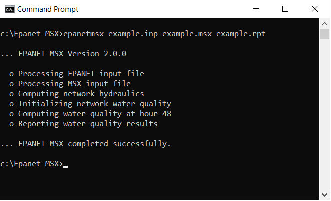

.. raw:: latex

    \clearpage

.. _usage:

PROGRAM USAGE
==============

EPANET-MSX is distributed in a compressed archive file named
EPANETMSX.ZIP. The contents of this archive are listed in :numref:`table-files`. The
top level archive folder contains a *Readme.txt* file that describes the
contents of the archive and procedures for reporting bugs.

 .. tabularcolumns:: |p{4cm}|p{11cm}|

.. _table-files:
.. table:: Files distributed with EPANET-MSX	
   :class: longtable
   
   +--------------------+-------------------------------------------------------+
   | Readme.txt         | describes the contents of the archive                 |
   +--------------------+-------------------------------------------------------+
   | | \\bin            | |                                                     |
   | |  epanetmsx.exe   | | command line version of EPANET-MSX                  |
   | |  epanetmsx.dll   | | EPANET-MSX function library                         |
   | |  epanet2.dll     | | standard EPANET function library                    |
   +--------------------+-------------------------------------------------------+
   | | \\Examples       | |                                                     |
   | |  example.inp     | | example EPANET input file                           |
   | |  example.msx     | | example MSX input file                              |
   +--------------------+-------------------------------------------------------+
   | | \\Doc            | |                                                     |
   | |  epanetmsx.pdf   | | EPANET-MSX users manual                             |
   | |  license.txt     | | licensing agreement for using EPANET-MSX            |
   +--------------------+-------------------------------------------------------+
   | | \\Include        | |                                                     |
   | |  epanetmsx.h     | | C/C++ header file for EPANET-MSX toolkit            |
   | |  epanetmsx.bas   | | Visual Basic declarations of EPANET-MSX functions   |
   | |  epanetmsx.pas   | | Delphi-Pascal declarations of EPANET-MSX functions  |
   | |  epanet2.h       | | C/C++ header file for EPANET2 toolkit               |
   | |  epanet2.bas     | | Visual Basic declarations of EPANET2 functions      |
   | |  epanet2.pas     | | Delphi-Pascal declarations of EPANET2 functions     |
   | |  epanetmsx.lib   | | Microsoft C/C++ LIB file for epanetmsx.dll          |
   | |  epanet2.lib     | | Microsoft C/C++ LIB file for epanet2.dll            |
   +--------------------+-------------------------------------------------------+
   | \\Src              | EPANET-MSX source files                               |
   +--------------------+-------------------------------------------------------+  
 

Most end users will only need to extract the files in the *\\bin*,
*\\examples*, and *\\doc* folders to a directory of their choosing.
Developers will also need the files in the *\\include* folder to write
custom applications. They should also be aware of the licensing
requirements set forth in the *license.txt* file.

The EPANET-MSX system is supplied as both:

-  a stand-alone console application (*epanetmsx.exe*) that can run
   standard water quality analyses without any additional programming
   effort required,

-  a function library (*epanetmsx.dll*) that, when used in conjunction
   with the original EPANET function library (*epanet2.dll*), can produce
   customized programming applications.

At this point in time the extension has not been integrated into the
Windows version of EPANET. This is expected to happen at some future
date. Examples of each type of usage are provided below.

Regardless of which approach is used, the user must prepare two input
files to run a multi-species analysis. One of these is a standard EPANET
input file that describes the hydraulic characteristics of the network
being analyzed (EPANET-MSX will ignore any water quality information
that might be in this file). The format of this file is described in the
EPANET Users Manual :cite:p:`Rossman2000,Rossman2020`. Any network file that was created,
edited and then exported from the Windows version of EPANET can serve as
the EPANET input file for the multi-species extension.

The second file that must be prepared is a special EPANET-MSX file that
describes the species being simulated and the chemical
reaction/equilibrium model that governs their dynamics. The format of
this file is described in :ref:`inputformat` (:numref:`inputformat`) of this manual.

*Example Command Line Run*
---------------------------

In order to demonstrate the use of the command line version of
EPANET-MSX we will simulate the arsenic oxidation/adsorption reaction
system that was briefly described in :ref:`framework` (:numref:`framework`) of this manual using the
simple pipe network shown in :numref:`Figure_3_1` that was adapted from :cite:t:`Zhang2004`. 
:numref:`table_3-2` lists the properties associated with the nodes of
this network while :numref:`table_3-3` does the same for the pipe links.

.. _Figure_3_1:

   Schematic of the example pipe network

.. tabularcolumns:: |p{3cm}|p{3cm}|p{4cm}|
.. _table_3-2:
.. table:: Nodal properties of the example pipe network

 +-------------------+----------------------------+--------------------------------+
 | **Node**          | **Elevation** (:math:`m`)  | **Demand** (:math:`m^3/hr`)    |         
 +===================+============================+================================+
 | Source            | 100                        | --                             |
 +-------------------+----------------------------+--------------------------------+
 | A                 | 0                          | 4.1                            |
 +-------------------+----------------------------+--------------------------------+
 | B                 | 0                          | 3.4                            |
 +-------------------+----------------------------+--------------------------------+
 | C                 | 0                          | 5.5                            |
 +-------------------+----------------------------+--------------------------------+
 | D                 | 0                          | 2.3                            |
 +-------------------+----------------------------+--------------------------------+

.. tabularcolumns:: |p{2cm}|p{3cm}|p{3cm}|p{3cm}|
.. _table_3-3:
.. table:: Pipe properties of the example pipe network

 +--------------+-----------------------+------------------------------+--------------+
 | **Pipe**     | **Length** (:math:`m`)| **Diameter** (:math:`mm`)    | **C-Factor** |
 +==============+=======================+==============================+==============+
 | 1            | 1000                  | 200                          | 100          |
 +--------------+-----------------------+------------------------------+--------------+
 | 2            | 800                   | 150                          | 100          |
 +--------------+-----------------------+------------------------------+--------------+
 | 3            | 1200                  | 200                          | 100          |
 +--------------+-----------------------+------------------------------+--------------+
 | 4            | 1000                  | 150                          | 100          |
 +--------------+-----------------------+------------------------------+--------------+
 | 5            | 2000                  | 150                          | 100          |
 +--------------+-----------------------+------------------------------+--------------+

The first step in running a multi-species analysis of a water
distribution system is to prepare a standard EPANET input file of the
system that contains all of the information needed to perform a
hydraulic analysis of the system. The Windows version of EPANET 2 was
used to draw the network layout and assign node and pipe attributes
using the program's graphical editing tools. A standard .INP file was
then created by issuing the **File \| Export \| Network** command. The
resulting file was named *example.inp* and is shown in :numref:`ex_input_file` (after
some editing was performed to remove empty sections and default
options). Note that for this simple application the water demands remain
constant over time and that a 48 hour simulation period is requested.

.. literalinclude:: example.inp
    :language: none
    :name: ex_input_file
    :caption: Contents of the *example.inp* input file.
..

The next step is to prepare the MSX input file that defines the
individual water quality species of interest and the reaction
expressions that govern their dynamics. This was done using a text
editor, following the format described in :ref:`inputformat` (:numref:`inputformat`) of this manual. The
resulting MSX input file, named *example.msx*, is shown in :numref:`ex_msx_file`.

.. literalinclude:: example.msx
    :language: none
    :name: ex_msx_file
    :caption: Contents of the *example.msx* input file.
..

There are several things of note in this file:

1. The species have been named as follows:

   -  AS3 is dissolved arsenite (:math:`As^{+3}`), expressed in :math:`\mu g/L`

   -  AS5 is dissolved arsenate (:math:`As^{+5}`), expressed in :math:`\mu g/L`

   -  AStot is total dissolved arsenic expressed in :math:`\mu g/L`

   -  AS5s is adsorbed arsenate, expressed in :math:`\mu g/m^2`

   -  NH2CL is dissolved monochloramine, expressed in :math:`mg/L`

2. The reaction rate coefficients, Ka and Kb, and the adsorption
   coefficients, :math:`K_1`, :math:`K_2`, and :math:`S_{max}`, have been designated as constants. If
   instead they varied by pipe, then they could have been declared as
   parameters and their values could have been adjusted on a
   pipe-specific basis in the [PARAMETERS] section of the file. Note
   that the units of these coefficients are as follows: :math:`(L/mg\text{-}hr)` for
   :math:`K_a`; :math:`(1/hr)` for :math:`K_b`, :math:`(L/\mu g\text{-}hr)` for :math:`K_1`; :math:`(1/hr)` for :math:`K_2`; :math:`\mu g/m^2`
   for :math:`S_{max}`.

3. The [PIPES] section supplies the three reaction rate expressions and
   the single equilibrium expression for this system as was presented
   previously in equations :eq:`As3` - :eq:`As5S` of :ref:`framework` (:numref:`framework`). For example, the rate
   expression for arsenite oxidation

   .. math:: 
     \begin{aligned}
     {d As^{+3} \over d {t}} = -k_a As^{+3}(NH_2Cl)
     \end{aligned}

   is expressed in the file as:

      RATE  :math:`\ ` As3 :math:`\ ` -Ka*As3*NH2CL

   while the equilibrium expression

   .. math:: 
     \begin{aligned}
     As_s^{+5}={{k_s S_{max} As^{+5}} \over {1+k_s As^{+5}}}
     \end{aligned}

   is re-written so that it has an implied 0 on the left hand side:

      EQUIL  :math:`\ ` As5s :math:`\ `  Ks*Smax*As5/(1 + Ks*As5) - As5s

4. The variable Av that appears in the rate expression for AS5 is a
   reserved symbol for the pipe wall surface area per unit of pipe
   volume. It is computed internally by EPANET-MSX and has units of area
   per liter, where the area units are the same as those specified in
   the [OPTIONS] section of the file.

5. Even though there are no tanks in this example, a [TANKS] section is
   still needed in the MSX file because both BULK and WALL species have
   been defined (Tank water quality reactions can not use wall species,
   which are associated only with pipes). If only BULK species were
   present then a redundant [TANKS] section would not be required.

6. An initial quality is assigned to the source reservoir which remains
   constant over the course of the simulation. If source quality was to
   vary over time or there were source injections at other locations
   they could be described in a [SOURCES] section.

7. In the [REPORT] section we ask that results for all species at nodes
   C and D and link 5 be written to the report file. 

The final step in analyzing arsenic oxidation/adsorption for our example
network is to run the EPANET-MSX command line executable. This can be
done by first opening a Command Prompt window in Windows, navigating to
the folder where *epanetmsx.exe* and the input files were saved, and
issuing the following command:

*epanetmsx example.inp example.msx example.rpt*

where *example.rpt* is the name of the file where the results will be
written. If the executable were saved to a different folder than that of
the example files, then either the full path name would have to be added
to the name of the executable on the command line or the folder name
would have to be added to the user's PATH environment variable. :numref:`figure_3_2` is a screen capture of what appears on the screen as the program
runs.

.. _figure_3_2:

   
   Command line execution of EPANET-MSX.
.. _section-6:

After the program finishes, the *example.rpt* file can be opened in any
text editor (such as Windows Notepad) where its contents can be viewed.
Excerpts from the results file are reproduced in :numref:`ex_rpt_file`. The first
page contains a summary of the standard EPANET options that were chosen
for the run. Following this is a table of results for each node and each
link. These tables contain the concentrations of each species at each
reporting period. Note that the surface species are not listed for nodes
since by definition this class of constituent is associated only with
pipe surfaces. At the end of the report file, the mass balance summaries of the three differential variables (:math:`As^{+3}`, ::math:`As^{+5}` and :math:`NH_2Cl`) are provided.

.. literalinclude:: example.rpt
    :language: none
    :name: ex_rpt_file
    :caption: EPANET-MSX results for the example network
..

*Example Toolkit Usage*
------------------------

Using the EPANET-MSX function library requires some programming effort
to build custom applications and must be used in conjunction with the
standard EPANET Programmer's Toolkit. Applications can be written in any
programming language that can call external functions residing in a
Windows DLL (or a Linux shared object library), such as C, C++, Visual
Basic, and Delphi Pascal. Section :ref:`sectoolkit` describes each function included in
the MSX toolkit library. The functions in the EPANET toolkit library are
described in the Help file distributed with that toolkit (available at `https://www.epa.gov/water-research/epanet <https://www.epa.gov/water-research/epanet>`__).

As an example of how the library can be used to construct an
application, :numref:`ex_source_file` displays the C code behind the command line
implementation of the MSX system, *epanetmsx.exe,* which was just
discussed. The listing begins by checking for the correct number of
command line arguments and then attempts to open and read the EPANET
file supplied as the first argument. It uses the EPANET toolkit function
*ENopen* for this purpose.

The code then begins a *do-while* loop that simplifies error detection
through the remainder of the program. The *MSXopen* function is used to
open and process the MSX file (the second command line argument), and
the *MSXsolveH* function is used to run a hydraulic analysis of the
network whose results are saved to a scratch file. This is followed by a
call to *MSXinit* to initialize the water quality analysis. Note that
the argument of 1 to this function tells the MSX system to save its
computed water quality results to a scratch file so that they can be
used for reporting purposes later on.

The program then begins another *do-while* loop that will step through
each water quality time step. At each such step, the *MSXstep* function
is called to update water quality throughout the network and save these
results to the scratch output file. This function also updates the
amount of time left in the simulation (stored in the variable named
*tleft*). The loop continues until either no more time is left or an
error condition is encountered.

If the simulation ends successfully, the *MSXreport* function is called
to write the water quality results to the report file that was named on
the command line. If a fourth file name was supplied on the command
line, then the *MSXsaveoutfile* is called to save the results in a
binary format to this file. Lastly, the MSX system is closed down by
calling *MSXclose* and the same is done for the EPANET system by calling
*ENclose*.

If the source code in :numref:`ex_source_file` was saved to a file named *msxepanet.c*
then it could be compiled into an executable named *epanetmsx.exe* by
using the following commands with the Microsoft C/C++ command line
compiler:

*CL  /c  epanetmsx.c*

*LINK  epanetmsx.obj  epanet2.lib  epanetmsx.lib  /OUT:epanetmsx.exe*

Note that when developing MSX applications in C/C++, the library modules
*epanet2.lib* and *epanetmsx.lib* must be linked in with the
application's object modules. Versions of these files that are
compatible with the Microsoft C/C++ compiler (Version 6 and higher) are
supplied with the EPANET-MSX distribution. Also, copies of the
distributed DLL files *epanet2.dll* and *epanetmsx.dll* must be placed in
the same directory as the application's executable file or reside in a
directory listed the user's PATH environment variable.

Users using other compilers or platforms would need to use the
appropriate commands to produce the required object library files and
executables.

.. literalinclude:: epanetmsx.c
    :language: c
    :name: ex_source_file
    :caption: C source code for the command line version of EPANET-MSX
..

*Using Compiled Reaction Models*
---------------------------------

EPANET-MSX has the option to compile the chemical reaction equations that a user specifies within their MSX input 
file using a C compiler that already resides on the user's system. This can speed up execution times by a factor of 2 to 5, 
depending on the nature of the reaction system and the choice of integration method. This option is available on Windows 
operating systems that have either the Microsoft Visual C++ compiler or the MinGW port of the Gnu C++ compiler installed, 
or on Linux systems with the Gnu C++ compiler. To utilize this option, one adds the following command to the :ref:`options` (:numref:`options`)
section of the MSX input file: 

**COMPILER** choice

where choice is **VC** for the Visual C++ compiler, **GC** for the MinGW or Gnu C++ compilers, or **NONE** for no compiler 
(the default compiler option). You can determine if your Windows system already has one of these compilers installed 
by opening a Command Prompt window and issuing the command CL for the Visual C++ compiler or gcc for the MinGW compiler.
If the system responds with a message saying that the command is not recognized, then the compiler is either not installed 
or has not been configured for general use.

The Gnu compiler comes standard with most Linux installations.