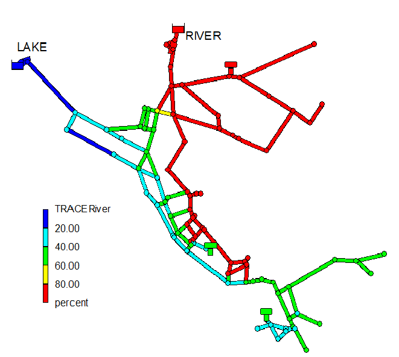
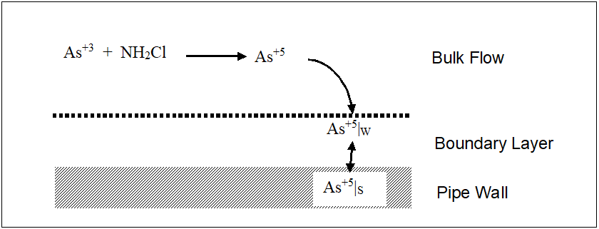
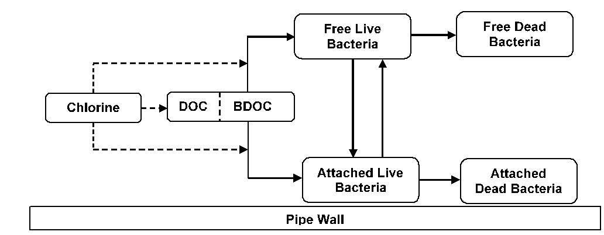

.. raw:: latex

    \clearpage

.. _examplesystems:

EXAMPLE REACTION SYSTEMS
===========================

This section demonstrates how several different multi-species reaction
systems of interest can be modeled with EPANET-MSX.

*Multi-Source Chlorine Decay*
-----------------------------

Multi-source networks present problems modeling a single species,
such as free chlorine, when the decay rates observed in the source
waters vary quite significantly. As the sources blend differently
throughout the network, it becomes difficult to assign a single decay
coefficient that accurately reflects the decay rate observed in the
blended water. Consider the distribution system shown in :numref:`Figure_5_1` that
is served by two different sources. The network has been color-coded to
show the average fraction of water in each pipe that originates from the
River (Source 1).

.. _Figure_5_1:

   
   Example of a two-source water distribution system showing the average percent of water originating from the River source

Assume that free chlorine reacts in the bulk flow along a pipe according
to the following first-order rate expression:

 .. math:: 
    \begin{aligned}
    {d {C} \over d {t}} = {-kC} 
    \end{aligned}
    :label: FirstOrder 

where :math:`C`` is the concentration of free chlorine at time :math:`t`` and :math:`k`` is a
reaction rate constant. Now suppose that when analyzed separately in
bottle tests, water from Source 1 has a :math:`k`` = 1.3 days\ :sup:`-1` while
Source 2's water has :math:`k`` = 17.7 days\ :sup:`-1`. The issue becomes one of
determining a :math:`{k}`-value for each pipe of the network that will reflect the
proper reactivity of the blended water from both sources.

One approach to reconciling the vastly different chlorine decay
constants in this example, without introducing a more complex chlorine
decay mechanism that attempts to represent the different reactivity of
the total organics from the two sources, is to assume that at any time
the chlorine decay constant within a pipe is given by a weighted average
of the two source values, where the weights are the fraction of each
source water present in the pipe. These fractions can be deduced by
introducing a fictitious conservative tracer compound at Source 1,
denoted as T1, whose concentration is fixed at a constant 1.0 :math:`mg/L`. Then
at any point in the network the fraction of water from Source 1 would be
the concentration of T1 while the fraction from Source 2 would be 1.0
minus that value. The resulting chlorine decay model now consists of
two-species -- a tracer species :math:`T1`` and a free chlorine species :math:`C`. The
first-order decay constant k for any pipe in the system would be given
by:

 .. math:: 
    \begin{aligned}
    k = 1.3{T1}+17.7{(1.0-T1)}
    \end{aligned}
    :label: DecayConstant 

while the system reaction dynamics would be expressed by:

 .. math:: 
    \begin{aligned}
    {d {T1} \over d {t}} = 0 
    \end{aligned}
    :label: DTDt 

 .. math:: 
    \begin{aligned}
    {d {C} \over d {t}} = {{-(1.3{T1}+17.7{(1.0-T1)})}C} 
    \end{aligned}
    :label: DCDt

:numref:`ex_twosources_inp` is the MSX input file that defines this model for a network
where the two source nodes are represented as reservoirs with ID names
"1" and "2", respectively. Note that it contains no surface species, no
equilibrium species, and assumes that a constant chlorine concentration
of 1.2 :math:`mg/L` is maintained at each source.

.. literalinclude:: twosources.inp
    :language: none
    :caption: EPANET-MSX input file for modeling two-source chlorine decay
    :name: ex_twosources_inp
..

*Oxidation, Mass Transfer, and Adsorption*
-------------------------------------------

This example is an extension and more complete description of the
arsenic oxidation/adsorption model that was presented previously in
sections :ref:`framework` (:numref:`framework`) and :ref:`usage` (:numref:`usage`) of this manual. 
It models the oxidation of arsenite :math:`As^{+3}` to arsenate :math:`As^{+5}` by a monochloramine disinfectant
residual :math:`NH_2Cl` in the bulk flow along with the subsequent
adsorption of arsenate onto exposed iron on the pipe wall. We also
include a mass transfer limitation to the rate at which arsenate can
migrate to the pipe wall where it is adsorbed.

:numref:`Figure_5_2` shows a schematic of the arsenic model. Note that after
arsenate is produced by the oxidation of arsenite in the bulk solution
it diffuses through a boundary layer to reach a concentration denoted as
:math:`As_w^{+5}` just adjacent to the pipe wall. It is this
concentration that interacts with adsorbed arsenate :math:`As_s^{+5}` on the pipe wall. 
Thus the system contains five species (dissolved arsenite in bulk solution, dissolved 
arsenate in bulk solution, monochloramine in bulk solution, dissolved arsenate just
adjacent to the pipe wall surface and sorbed arsenate on the pipe
surface). One might argue that arsenate is a single species that appears
in three different forms (bulk dissolved, wall dissolved, and wall
sorbed), but for the purposes of modeling it is necessary to distinguish
each form as a separate species.

.. _Figure_5_2:

    Schematic of the mass transfer limited arsenic oxidation/adsorption system

The mathematical form of this reaction system can be modeled with five
differential rate equations in the case of non-equilibrium
adsorption/desorption (see, e.g., :cite:`Gu1994`, for a more complete
description of non-equilibrium adsorption/desorption):

.. math::
   \begin{aligned}
   {d As^{+3} \over {d t}} = -k_a As^{+3}(NH_2Cl)
   \end{aligned}
   :label: 5-As3

.. math::
   \begin{aligned}
   {d (NH_2Cl) \over {d t}} =-k_b (NH_2Cl)
   \end{aligned}
   :label: 5-NH2Cl

.. math::
   \begin{aligned}
   {d As^{+5} \over {d t}} = k_a As^{+3}(NH_2Cl)-K_fA_v(As^{+5}-As_w^{+5})
   \end{aligned}
   :label: 5-As5

.. math::
   \begin{aligned}
   {d As_w^{+5} \over {d t}}= K_fA_v(As^{+5}-As_w^{+5})-A_v[k_1(S_{max}-As_s^{+5})As_w^{+5}-k_2As_s^{+5}]
   \end{aligned}
   :label: 5-As5W

.. math::
   \begin{aligned}
   {d As_s^{+5} \over {d t}}= {k_1(S_{max}-As_s^{+5})As_w^{+5}-k_2As_s^{+5}}
   \end{aligned}
   :label: 5-As5S

where :math:`As^{+3}` is the bulk phase concentration of arsenite,
:math:`As^{+5}` is the bulk phase concentration of arsenate, :math:`As_w^{+5}` is
the bulk phase concentration of arsenate adjacent to the pipe wall,
:math:`As_s^{+5}` is surface phase concentration of arsenate, and
:math:`NH_2Cl` is the bulk phase concentration of monochloramine. The
parameters in these equations are as follows: :math:`k_a` is a rate
coefficient for arsenite oxidation, :math:`k_b` is a monochloramine
decay rate coefficient due to reactions with all other reactants
(including arsenite), :math:`A_v` is the pipe surface area per liter of
pipe volume, :math:`k_1` and :math:`k_2` are the arsenate adsorption and
desorption rate coefficients, :math:`S_{max}` is the maximum pipe surface
concentration, and :math:`K_f` is a mass transfer rate coefficient. The
mass transfer coefficient :math:`K_f` will in general depend on the
amount of flow turbulence as well as the diameter of the pipe. A typical
empirical relation might be:

.. math::
   \begin{aligned}
   K_f = {{1.6 \times 10^{-4}Re^{0.88}} \over {D}}
   \end{aligned}
   :label: masstransfer

where :math:`Re` is the flow Reynolds number and :math:`D` is the pipe diameter.

Using the notation defined in :eq:`DAEbulk`-:eq:`DAEequil`, :math:`\boldsymbol{x}_b` =
{:math:`As^{+3}`, :math:`As^{+5}`, :math:`As_w^{+5}`, :math:`NH_2Cl`},
:math:`\boldsymbol{x}_s` = {:math:`As_s^{+5}`}, :math:`\boldsymbol{z}_b` = {:math:`\emptyset`}, :math:`\boldsymbol{z}_s` = {:math:`\emptyset`}, 
and :math:`\boldsymbol{p}` = {:math:`k_a`, :math:`k_b`, :math:`A_v`, :math:`k_1`,
:math:`k_2`, :math:`K_f`, :math:`S_{max}`}. The reaction dynamics defined
by :eq:`5-As3`-:eq:`5-As5S` conserves total arsenic mass within any pipe segment of
length L (and thus bulk volume :math:`A \times L`, and pipe surface area :math:`P \times L`, where :math:`A`
and :math:`P` are cross sectional area and wetted perimeter, respectively). This
can be shown by summing the differential changes in the mass of all
arsenic species within a pipe segment, and assuring that they sum to zero: :math:`(A \times L) ({d {As^{+3}} \over {dt}}) + (A \times L) ({d As^{+5} \over dt}) + (A \times L)({d As_w^{+5} \over dt}) + (P \times L) ({d As_s^{+5} \over dt}) = 0`.

It was mentioned in :ref:`framework` (:numref:`framework`) that some reactions are reversible and
fast enough in comparison with the system's other processes so that a
local equilibrium can be assumed, while others are not sufficiently fast
and/or irreversible and it is inappropriate to use an equilibrium
formulation to represent them. In the case of reversible sorption
processes a local equilibrium assumption (LEA) is sometimes assumed
between the adsorbed phase and its concentration in the bulk fluid (such
an assumption is not always realistic, and no such claim is made here -
see, e.g., :cite:`Koopman1992`). Under the LEA, the rates of
adsorption and desorption must be much faster than the rate of change of
the bulk species, and consequently, :math:`{d As_s^{+5} \over dt} = 0`; the
differential equation :eq:`5-As5S` can then be substituted with the algebraic
equation:

.. math::
   \begin{aligned}
   As_s^{+5}={{k_s S_{max}As_w^{+5}} \over {1+k_sAs_w^{+5}}}
   \end{aligned}
   :label: 5-AsS5-Equil

where :math:`k_s = k_1/k_2`. In this case the DAE system
is described by :eq:`5-As3`-:eq:`5-As5W` and :eq:`5-AsS5-Equil`, and includes four differential rate
equations and one algebraic equation. Thus in terms of the notation used
in :eq:`DAEbulk`-:eq:`DAEequil`, :math:`\boldsymbol{x}_b` = {:math:`As^{+3}`, :math:`As^{+5}`, 
:math:`As_w^{+5}`, :math:`NH_2Cl`}, :math:`\boldsymbol{x}_s` = {:math:`\emptyset`}, :math:`\boldsymbol{z}_b` = {:math:`\emptyset`}, 
:math:`\boldsymbol{z}_s` = {:math:`As_s^{+5}`}, and :math:`\boldsymbol{p}` = {:math:`k_a`, :math:`k_b`, :math:`A_v`, :math:`k_1`,
:math:`k_2`, :math:`K_f`, :math:`S_{max}`}.  The
LEA model could be left in this form that explicitly includes the
surface adsorbed phase (:math:`As_s^{+5}`) - or, because the special form of
:eq:`5-AsS5-Equil` presents an explicit solution for the adsorbed arsenate, :eq:`5-AsS5-Equil`
could be substituted into :eq:`5-As5W`, leaving an equivalent system of only
four differential rate expressions in the four bulk-phase variables
:math:`\boldsymbol{x}_b` = {:math:`As^{+3}`, :math:`As^{+5}`, 
:math:`As_w^{+5}`, :math:`NH_2Cl`}. In this latter case, however, the adsorbed phase
arsenate concentration would have to be separately calculated after
solution (if desired), using :eq:`5-AsS5-Equil`, which could be laborious if it were
required at many locations and time steps.

:numref:`ex_arsenic_inp` shows the MSX input file for this system, with the assumption
of local equilibrium (:eq:`5-As3`-:eq:`5-As5W` and :eq:`5-AsS5-Equil`). The [PIPES] section
contains four kinetic rate reactions involving the four bulk species and
one equilibrium reaction that includes the lone surface species. The
[TANKS] section contains only the bulk species reactions. To complete
the model specification, the [QUALITY] section assumes that the network
has a single source which is a reservoir node labeled "1", and that the
concentrations at this source remain constant. If this were not the case
then a [SOURCES] section could be added that describes the sources in
more detail.

.. literalinclude:: arsenic.msx
    :language: none
    :caption: MSX input file for the mass transfer limited arsenic oxidation/adsorption system
    :name: ex_arsenic_inp
..

*Note about equation units.* The modeler must understand the units of
all quantities used in mathematical expressions, and ensure that the
resulting expressions are dimensionally correct. In short, a complete
unit analysis for each expression and resulting RATE or EQUIL term is an
essential quality assurance step for developing MSX models. As an
example, consider :eq:`5-As5W` above, repeated here for convenience:

.. math::
   \begin{aligned}
   {d As_w^{+5} \over {d t}}= K_fA_v(As^{+5}-As_w^{+5})-A_v[k_1(S_{max}-As_s^{+5})As_w^{+5}-k_2As_s^{+5}]
   \end{aligned}

The units of the left hand side are the units of the bulk species,
:math:`As_w^{+5}`, divided by the units used for time. Since the default time
unit is hours, the left hand side has units of [:math:`\mu g/L\mbox{-}hr`], and
consequently each of the two main terms on the right hand side must have
these same units. Since :math:`A_v` was previously defined as the pipe
surface area per liter pipe volume, and the default area unit is
[:math:`ft^2`], this quantity has units of [:math:`ft^2/L`] (:math:`A_v`
is a pre-defined MSX hydraulic variable - see the description of the
:ref:`terms` input in :ref:`inputformat` (:numref:`inputformat`) of this manual). From this analysis we find
that the mass transfer coefficient :math:`K_f` in the first term on the
right hand side must have units of [:math:`L/ft^2\mbox{-}hr`]. The units of the
previous expression for :math:`K_f` in :eq:`masstransfer` are, however, the more
conventional velocity units of [:math:`ft/hr`], requiring multiplication by the
number of liters per cubic ft: :math:`[ft/hr] \times [L/ ft^3]` =
:math:`[L/ft^2\mbox{-}hr]`. This unit analysis explains the presence of the
term LPERCF in the above MSX input file; without this term the
expressions would not be dimensionally consistent and the results would
be invalid. The reader should verify that the second term on the right
hand side is dimensionally correct - given the units of :math:`A_v`-
provided that rate coefficient :math:`k_1` has units [:math:`L/\mu g\mbox{-}hr`], and
:math:`k_2` has units [:math:`1/hr`] (recall that the surface species has units
of [:math:`\mu g/ft^2`], since we are using the default area units).

*Bacterial Regrowth with Chlorine Inhibition*
----------------------------------------------

This next example models bacterial regrowth as affected by chlorine
inhibition within a distribution system. The regrowth model is taken
from :cite:t:`Zhang2004` and includes the following processes depicted
in :numref:`Figure_5_3`:

.. _Figure_5_3:

   Conceptual diagram of bacterial regrowth within a pipeline. Dashed arrows represent reactions with chlorine while solid arrows represent transformation processes

a. Both free bacteria in the bulk flow and bacteria attached to the pipe
   wall utilize the biodegradable fraction of dissolved organic carbon
   (BDOC and DOC, respectively) as a growth substrate. Monod kinetics
   are used to describe this growth with the following rate equations:

.. math::
   \begin{aligned}
   {{d X}\over {dt}}\bigg |_{growth} = \mu X
   \end{aligned}

   \begin{aligned}
   {{d S}\over {dt}} = -\mu X/Y
   \end{aligned}

..
  
   where :math:`X` is mass concentration of bacterial cells, :math:`S` is the
   concentration of BDOC, :math:`Y` is a yield coefficient (mass of cells
   produced per unit conversion of BDOC), and :math:`\mu` is a specific growth
   coefficient. The latter decreases with the BDOC concentration
   according to:

.. math::
   \begin{aligned}
   \mu = {{\mu_{max}S}\over{S+K_s}}
   \end{aligned}
..

   where :math:`\mu_{max}` is the maximum growth rate coefficient and :math:`K_s` is the half-saturation constant.

b. Both free and attached bacteria die at a first order rate:

.. math::
   \begin{aligned}
   {{d X}\over {dt}}\bigg |_{decay} = -k_d X
   \end{aligned}
..

   where :math:`k_d` is a decay rate coefficient.

c. Deposition of free bacterial cells onto the pipe wall is modeled with
   the following first-order rate process:

.. math::
   \begin{aligned}
   {{d X}\over {dt}}\bigg |_{deposition} = -k_{dep} X
   \end{aligned}
..

   while detachment of attached cells into the bulk flow also depends on
   flow velocity:

.. math::
   \begin{aligned}
   {{d X}\over {dt}}\bigg |_{detachment} = k_{det} X U
   \end{aligned}
..

   where :math:`k_{dep}` is a deposition rate constant, :math:`k_{det}` is a
   detachment rate constant, and :math:`U` is the bulk flow velocity.

d. The effect of chlorine on limiting the number of viable bacterial
   cells is modeled by applying an inhibition factor :math:`I` to the bacterial
   specific growth rate as:

.. math::
   \begin{aligned}
   I = exp \left ( {-(C-C_t)}\over {C_c}\right)
   \end{aligned}
..
   
   Here :math:`C` is the chlorine concentration, :math:`C_t` is a threshold
   chlorine concentration below which no inhibition occurs, and
   :math:`C_c` is a characteristic chlorine concentration that scales
   the degree of inhibition. Note at higher values of :math:`C`, :math:`I` becomes
   smaller and therefore results in smaller bacterial growth rates.

e. Chlorine reacts with DOC in the bulk flow to decay at a first-order
   rate:

.. math::
   \begin{aligned}
   {{d C}\over {dt}} = -k_{b} C
   \end{aligned}
..

   where :math:`C` is chlorine concentration and :math:`k_b` is a bulk decay
   rate coefficient.

The EPANET-MSX specification of the full model is shown in Figure :numref:`chloramine_inp`.

.. literalinclude:: chloramine.msx
    :language: none
    :caption: MSX input file for a bacterial regrowth model with chlorine inhibition
    :name: chloramine_inp
..

Several notes of explanation require mentioning:

1.  There are six species defined for the model: bulk chlorine (CL2),
    bulk biodegradable dissolved organic carbon (S), bulk bacterial
    concentration (Xb), bulk bacterial cell count (Nb), attached
    bacterial concentration (Xa), and attached bacterial cell count
    (Na). CL2 and S are measured in milligrams. The bacterial
    concentrations are expressed in micrograms of equivalent carbon so
    that their numerical values scale more evenly. The bacterial cell
    counts are expressed as the logarithm of the number of cells.

2.  The entries in the [PARAMETERS] section are based on values provided
    by :cite:t:`Zhang2004` and are used only for illustrative purposes.

3.  The [TERMS] section allows one to define intermediate mathematical
    terms in the model's description so that the rate equations can be
    expressed more clearly and compactly.

4.  The chlorine inhibition threshold concentration is lower for the
    bulk phase than for the surface phase. This results in defining
    separate inhibition factors, Ib and Ia for these two phases,
    respectively.

5.  The special EPANET-MSX function STEP(x) used in the definitions of
    the inhibition factors Ib and Ia is internally evaluated to 1 when
    x > 0 and is 0 otherwise.

6.  The variables U and Av are reserved symbols in EPANET-MSX that
    represent flow velocity and pipe surface area per unit volume,
    respectively, and their values are automatically computed by the
    program.

7.  Whenever the surface biomass species appears in the rate expression
    for a bulk species it is multiplied by Av to convert from areal
    density to volumetric concentration. Likewise, the bulk biomass
    concentration is divided by Av in the rate expression for attached
    biomass to convert it to an areal density.

8.  The kinetic rate expressions for tanks do not include any terms
    involving Xa since it is assumed that surface species do not exist
    (or have reduced significance) within storage facilities.

9.  A simple FORMULA expression is used to convert from micrograms of
    bacterial carbon to logarithmic cell counts. It assumes that there
    are :math:`10^6` cells per microgram of carbon in the cell biomass.

10. The model assumes that there is a single source node named SrcNode
    that supplies all water to the system. The [SOURCES] section
    specifies the concentrations of chlorine, biodegradable carbon, and
    bulk bacterial concentration in this water. The latter value was
    derived from assuming that the treated source water contained 10
    cells/mL (i.e., :math:`10^4` cells per liter).

*Chloramine Decomposition*
---------------------------

This final example illustrates a complex chemical reaction system
involving both kinetic rate expressions and nonlinear equilibrium
relationships. The system being studied is the auto-decomposition of
monochloramine to ammonia in the presence of natural organic matter
(NOM). When chloramines are used as a secondary disinfectant care must
be taken to avoid producing excessive amounts of free ammonia that can
contribute to biological nitrification episodes within the distribution
system. The reaction model used for this system was developed by
Valentine and co-workers :cite:`Valentine2001, Valentine2005`
and is shown in Table :numref:`table-monochloramine`. The principal species are hypochlorous acid
(HOCl), hypochlorite ion (OCL\ :sup:`-`), ammonia (NH\ :sub:`3`),
ammonium ion (NH\ :sub:`4`\ :sup:`+`), monochloramine
(NH\ :sub:`2`\ Cl), dichloramine (NHCl\ :sub:`2`), an unidentified
intermediate compound (I), and total organic carbon (TOC). Because the
reactions involve acid-base dissociations and the rate coefficient of
the disproportionation of NH\ :sub:`2`\ Cl is a function of both pH and
carbonate species, the pH-carbonate equilibrium system is also included.

:numref:`ex_monochloramine_inp` shows the EPANET-MSX specification of the monochloramine
decay model. There are 14 bulk species and no surface species. The entries in the [COEFFICIENTS] section are
the rate coefficients :math:`k_1` through :math:`k_{12}` listed in :numref:`table-monochloramine`. The expression for :math:`k_5`
as a function of pH and carbonate species is included in the [TERMS]
section, as are the rate terms contributed by the reactants of reactions
1 through 12 in :numref:`table-monochloramine`. Because there are no surface species in the
model, the reaction expressions listed in the [PIPES] section apply to
the storage tanks as well.

The first five rate expressions apply to the various chlorinated
species, ammonia, and the un-named intermediate compound. The next three
rate expressions, all set equal to 0, state that pH, alkalinity, and TOC
are assumed to remain constant. These are followed by two equilibrium
expressions that represent the dissociation reactions of hypochlorous
acid and ammonia, respectively. The final set of four equilibrium
expressions model the distribution of the various carbonate species
under conditions of constant alkalinity and pH. Note that in order to
solve this carbonate equilibrium sub-system it is necessary to supply
initial values for pH and alkalinity at all nodes of whatever network is
being modeled. This is done in the [QUALITY] section, using the GLOBAL
specifier to set values throughout the network. (The alkalinity of 0.004
moles/L is equivalent to 200 :math:`mg/L` CaCO\ :sub:`3` while the
H\ :sup:`+` value of :math:`2.818 \times 10^{-8}` moles/L is the same as a pH of
7.75.)

.. tabularcolumns:: |p{1.0cm}|p{5cm}|p{10cm}|

.. _table-monochloramine:
.. table:: Monochloramine decay model based on Vikesland et al. (2001) and Duirk et al. (2005).

 +-------+--------------------------------------------------------------+---------------------------------------------------------------+
 |       | *Reaction Stoichiometry*                                     | *Rate Coefficient/Equilibrium Constant*\ :sup:`a`             |
 +=======+==============================================================+===============================================================+
 | R.1   | HOCl + NH\ :sub:`3` :math:`\rightarrow`                      | :math:`k_1=1.5 \times 10^{10} M^{-1}h^{-1}`                   |
 |       | NH\ :sub:`2`\ Cl + H\ :sub:`2`\ O                            |                                                               |
 |       |                                                              |                                                               |
 |       |                                                              |                                                               |
 +-------+--------------------------------------------------------------+---------------------------------------------------------------+
 | R.2   | NH\ :sub:`2`\ Cl + H\ :sub:`2`\ O                            | :math:`k_2=7.6 \times 10^{-2}\,h^{-1}`                        |
 |       | :math:`\rightarrow` HOCl + NH\ :sub:`3`                      |                                                               |
 +-------+--------------------------------------------------------------+---------------------------------------------------------------+
 | R.3   | HOCl + NH\ :sub:`2`\ Cl :math:`\rightarrow`                  | :math:`k_3=1.0 \times 10^{6}M^{-1}\,h^{-1}`                   |
 |       | NHCl\ :sub:`2` + H\ :sub:`2`\ O                              |                                                               |
 +-------+--------------------------------------------------------------+---------------------------------------------------------------+
 | R.4   | NHCl\ :sub:`2` + H\ :sub:`2`\ O                              | :math:`k_4=2.3 \times 10^{-3}\,h^{-1}`                        |
 |       | :math:`\rightarrow` HOCl + NH\ :sub:`2`\ Cl                  |                                                               |
 +-------+--------------------------------------------------------------+---------------------------------------------------------------+
 | R.5   | NH\ :sub:`2`\ Cl + NH\ :sub:`2`\ Cl                          | :math:`k_5=2.5 \times 10^{7}[H^{+}]+4.0 \times 10^{4}[H_2CO_3]|
 |       | :math:`\rightarrow` NHCl\ :sub:`2` + NH\ :sub:`3`            | +800[HCO_3^{-}]\,M^{-2}h^{-1}`                                |
 +-------+--------------------------------------------------------------+---------------------------------------------------------------+
 | R.6   | NHCl\ :sub:`2` + NH\ :sub:`3` :math:`\rightarrow`            | :math:`k_6=2.2 \times 10^{8}\,M^{-2}h^{-1}`                   |
 |       | NH\ :sub:`2`\ Cl + NH\ :sub:`2`\ Cl                          |                                                               |
 +-------+--------------------------------------------------------------+---------------------------------------------------------------+
 | R.7   | NHCl\ :sub:`2` + H\ :sub:`2`\ O :math:`\rightarrow` I        | :math:`k_7=4.0 \times 10^{5}\,M^{-1}h^{-1}`                   |
 +-------+--------------------------------------------------------------+---------------------------------------------------------------+
 | R.8   | I + NHCl\ :sub:`2` :math:`\rightarrow` HOCl + products       | :math:`k_8=1.0 \times 10^{8}\,M^{-1}h^{-1}`                   |
 +-------+--------------------------------------------------------------+---------------------------------------------------------------+
 | R.9   | I + NH\ :sub:`2`\ Cl :math:`\rightarrow` products            | :math:`k_9=3.0 \times 10^{7}\,M^{-1}h^{-1}`                   |
 +-------+--------------------------------------------------------------+---------------------------------------------------------------+
 | R.10  | NH\ :sub:`2`\ Cl + NHCl\ :sub:`2` :math:`\rightarrow`        | :math:`k_{10}=55.0\,M^{-1}h^{-1}`                             |
 |       | products                                                     |                                                               |
 +-------+--------------------------------------------------------------+---------------------------------------------------------------+
 | R.11  | NH2Cl + S\ :sub:`1`\ :math:`\times`                          | :math:`k_{11}=3.0 \times 10^{4}\,M^{-1}h^{-1}`                |
 |       | TOC :math:`\rightarrow` products\ :sup:`b`                   |                                                               |
 |       |                                                              | :math:`S_1` = 0.02                                            |
 +-------+--------------------------------------------------------------+---------------------------------------------------------------+
 | R.12  | HOCl + S\ :sub:`2`\ :math:`\times`                           | :math:`k_{12}=6.5 \times 10^{5}\,M^{-1}h^{-1}`                |
 |       | TOC :math:`\rightarrow` products\ :sup:`c`                   |                                                               |
 |       |                                                              | :math:`S_2` = 0.5                                             |
 +-------+--------------------------------------------------------------+---------------------------------------------------------------+
 |       |                                                              |                                                               |
 +-------+--------------------------------------------------------------+---------------------------------------------------------------+
 | E.1   | HOCl :math:`\leftrightarrow` H\ :sup:`+` + OCl\ :sup:`-`     | :math:`pK_a` = 7.5                                            |
 |       |                                                              |                                                               |
 +-------+--------------------------------------------------------------+---------------------------------------------------------------+
 | E.2   | NH\ :sub:`4`\ :sup:`+` :math:`\leftrightarrow`               | :math:`pK_a` = 9.3                                            |
 |       | NH\ :sub:`3` + H\ :sup:`+`                                   |                                                               |
 +-------+--------------------------------------------------------------+---------------------------------------------------------------+
 | E.3   | H\ :sub:`2`\ CO\ :sub:`3` :math:`\leftrightarrow`            | :math:`pK_a` = 6.3                                            |
 |       | HCO\ :sub:`3`\ :sup:`-` +                                    |                                                               |
 |       | H\ :sup:`+`                                                  |                                                               |
 +-------+--------------------------------------------------------------+---------------------------------------------------------------+
 | E.4   | HCO\ :sub:`3`\ :sup:`-` :math:`\leftrightarrow`              | :math:`pK_a` = 10.3                                           |
 |       | CO\ :sub:`3`\ :sup:`2-` +                                    |                                                               |
 |       | H\ :sup:`+`                                                  |                                                               |
 +-------+--------------------------------------------------------------+---------------------------------------------------------------+

:math:`\ \ \ \ ` Notes:

   a. All rate coefficients and equilibrium constants are for 25 degrees C.

   b. :math:`S_1` is the fast reactive fraction of TOC.

   c. :math:`S_2` is the slow reactive fraction of TOC.

.. literalinclude:: monochloramine.msx
    :language: none
    :caption: EPANET-MSX input file of the monochloramine decomposition model
    :name: ex_monochloramine_inp
..